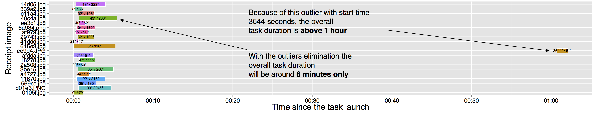
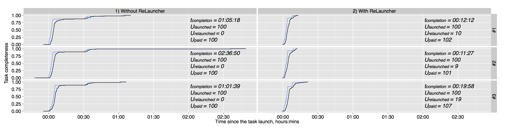

# Crowd-ReLauncher
A runtime controller, which cancels and relaunches delayed units on [CrowdFlower](http://www.crowdflower.com) to improve the overall task execution time.

An example of a task with 20 units ran on CrowdFlower:

A comparison of a task with 100 units ran *without* and *with* **ReLauncher**:

You can deploy ReLauncher on Heroku in one-click for free:

#### [Checkout out demo](https://crowd-relauncher.herokuapp.com)
To use the demo you need to enter your CrowdFlower API Key, you can find [here](https://make.crowdflower.com/account/user). This API key is not stored anywhere and is used only to send requests to CrowdFlower from your account.

